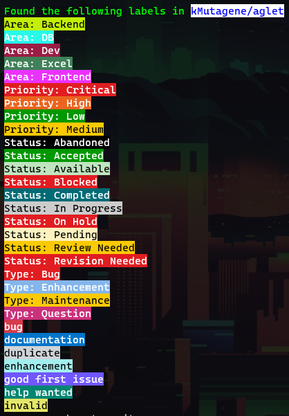
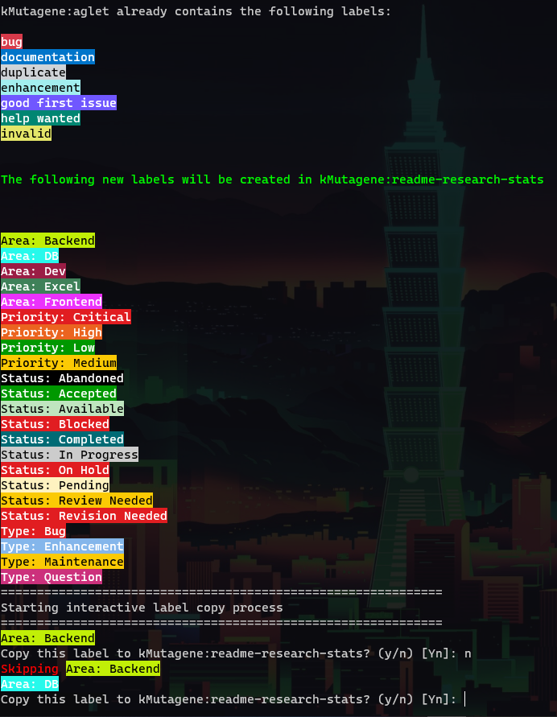

# aglet
A github label editing tool (aglet) is not only a cap for shoelaces but now also a dotnet tool to edit labels of github repositories

Install
-------

You can install aglet as local or global dotnet tool:

`dotnet tool install aglet` (local)

`dotnet tool ionstall aglet -g` (global)

Usage
-----

### General:

_Keep in mind that you have to prepend `dotnet` if you use aglet as local tool_

```(Powershell)
USAGE: aglet [--help] --auth <token|env> <value> [--debug] [<subcommand> [<options>]]

SUBCOMMANDS:

    list <options>        List all labels of the repository. <repo> must be of form 'owner/repoName'
    create <options>      Create Labels in a repository. Labels can be created interactively or taken from a json source.
    copy <options>        Copy labels from one repository to another. <from-repo> and <to-repo> must be of form 'owner/repoName'

    Use 'aglet <subcommand> --help' for additional information.

OPTIONS:

    --auth <token|env> <value>
                          How to authenticate at Github. token: raw string of a authentication token. env: name of an environment variable where your token is stored
    --debug               Print infortation usefull for debugging aglet
    --help                display this list of options.
```

<br>
<br>

### General options

 - Authentication:

    **Providing an auth token for github's API is mandatory.**

    When storing a github auth token in the environment variable `GithubDevToken`, you can use it like this:

    ```(Powershell)
    > aglet --auth env GithubDevToken ...
    ```

    otherwise, pass the raw token with the `token option`:

    ```(Powershell)
    > aglet --auth token "MySecretTokenString" ...
    ```

<br>

### Subcommands:

- #### `list`

    ```(Powershell)
    USAGE: aglet list [--help] <repoAddress>

    SOURCE REPO:

        <repoAddress>         The source repository to list labels from. Must be of form 'owner/repoName'

    OPTIONS:

        --help                display this list of options.
    ```

    <br>

    **Example**: `aglet --auth env "MyToken" list kMutagene/aglet`

    

    <br>

- #### `create`

    WIP (will be able to bulk create labels from a json source file)

- #### copy

    ```(Powershell)
    USAGE: aglet copy [--help] --source-repo <sourceRepoAddress> --target-repo <targetRepoAddress> [--interactive]

    OPTIONS:

        --source-repo <sourceRepoAddress>
                              The source repository to copy labels from. Must be of form 'owner/repoName'
        --target-repo <targetRepoAddress>
                              The target repository to copy labels to. Must be of form 'owner/repoName'
        --interactive, -i     Copy labels in interactive mode. Ask for each label if you want to copy it.
        --help                display this list of options.
    ```

    <br>

    **Example**: 

    `dotnet aglet --auth env "MyTokenEnv" copy --source-repo kMutagene/aglet --target-repo kMutagene/readme-research-stats -i`
    
    Will first show the label diff between both repositories and then proceed with an interactive process to add labels from the `source-repo` to the `target-repo`:

    

    <br>

### Libraries used
Special thanks to the following OSS libraries that make it possible to create a tool like this with ease

 - [Argu](https://github.com/fsprojects/Argu/)
 - [Http.fs](https://github.com/haf/Http.fs)
 - [Pastel](https://github.com/silkfire/Pastel)