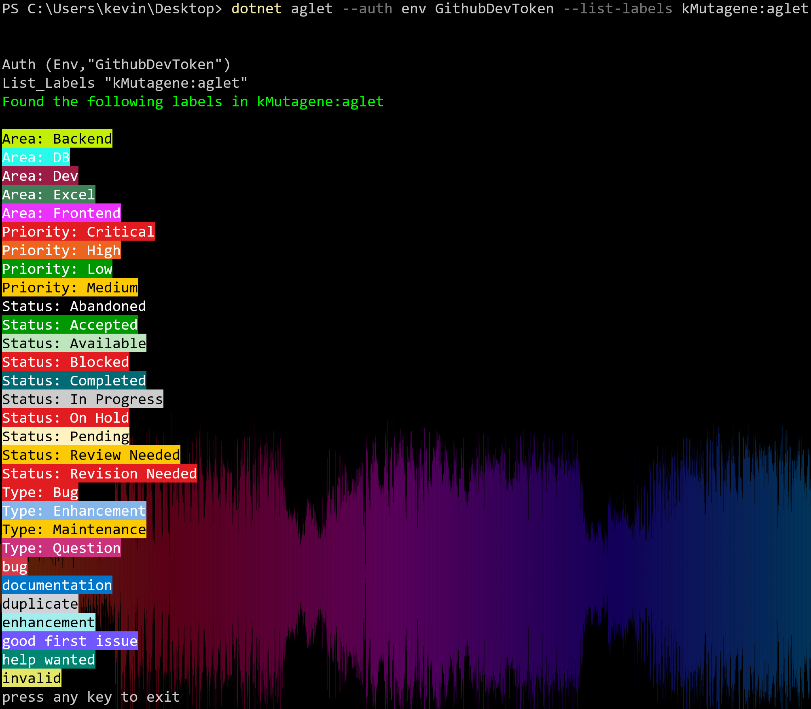

# aglet
A github label editing tool (aglet) is not only a cap for shoelaces but now also a dotnet tool to edit labels of github repositories

Install
-------

You can install aglet as local or global dotnet tool:

`dotnet tool install aglet` (local)

`dotnet tool ionstall aglet -g` (global)

Usage
-----

#### General:

```(Powershell)
    USAGE: aglet [--help] --auth <token|env> <value> [--list-labels <repo>] [--create-labels]
                 [--copylabels <from repo> <to repo>]

    OPTIONS:

        --auth <token|env> <value>
                              How to authenticate at Github. token: raw string of a authentication token. env: name
                              of an environment variable where your token is stored
        --list-labels <repo>  List all labels of the repository. <repo> must be of form 'owner:repoName'
        --create-labels       Create Labels interactively
        --copylabels <from repo> <to repo>
                              copy labels from one repository to another. <from-repo> and <to-repo> must be of form
                              'owner:repoName'
        --help                display this list of options.
```

<br>
<br>

#### Examples:

lets say you stored a github auth token in the environment variable `GithubDevToken`:

```
> dotnet aglet --auth env GithubDevToken --list-labels owner:repo
```

will return a neatly formatted list of labels:



```
> dotnet aglet --auth env GithubDevToken --copylabels fromOwner:fromRepo toOwner:toRepo 
```

will first list you all labels from fromOwner:fromRepo and ask you if you want to copy them. afterwards it attem,pts to create all listed labels in toOwner:toRepo:
